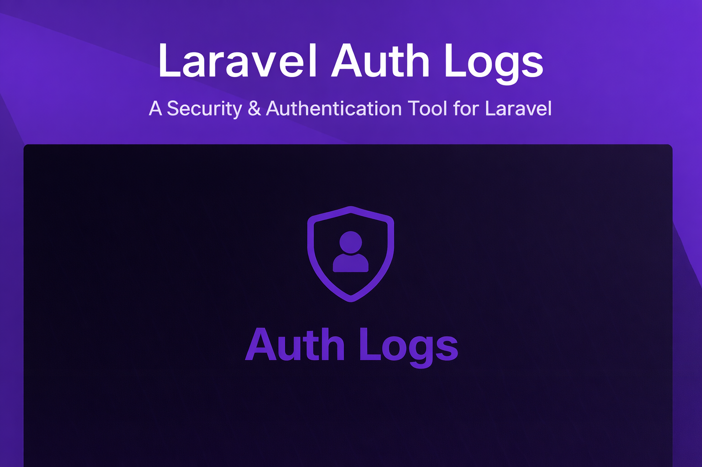

<div align="center">
<h1>Laravel Authentication Logs</h1>

[](https://packagist.org/packages/akira/laravel-auth-logs)
[](https://packagist.org/packages/akira/laravel-auth-logs)
[](https://phpstan.org)
[](https://github.com/akira-io/laravel-auth-logs/blob/main/LICENSE)


</div>

Laravel Authentication Logs records authentication activity for Laravel applications. It listens to Laravel authentication events, stores request context in a polymorphic log table, and sends mail notifications for security-relevant events.

## Features

- Records successful login attempts.
- Records failed login attempts when Laravel provides a user instance.
- Marks the latest authentication log as logged out on user logout.
- Detects new devices by successful login history for the same IP address and user agent.
- Sends queued mail notifications for failed login and new device login events.
- Resolves optional geolocation context for notification messages.
- Supports configurable table name, database connection, events, listeners, templates, notification toggles, and retention value.

The package also subscribes to Laravel's `OtherDeviceLogout` event as a customization hook. The default listener does not write a log entry.

## Requirements

- PHP 8.4 or higher
- Laravel 12.0 or 13.0
- An authenticatable model that uses Laravel notifications

The test workflow validates both Laravel 12 and Laravel 13 dependency sets.

## Installation

Install the package with Composer:

```bash
composer require akira/laravel-auth-logs
```

Publish the configuration and migration:

```bash
php artisan auth-logs:install
php artisan migrate
```

Add the `AuthLogs` trait to your authenticatable model:

```php
use Akira\LaravelAuthLogs\Concerns\AuthLogs;
use Illuminate\Foundation\Auth\User as Authenticatable;
use Illuminate\Notifications\Notifiable;

class User extends Authenticatable
{
    use Notifiable, AuthLogs;
}
```

## Documentation

Full documentation is available under [docs/](docs/README.md):

- [Installation](docs/01-installation.md)
- [Configuration](docs/02-configuration.md)
- [Usage](docs/03-usage.md)
- [Notifications](docs/04-notifications.md)
- [Advanced Usage](docs/05-advanced-usage.md)
- [API Reference](docs/06-api-reference.md)
- [Testing](docs/07-testing.md)
- [Troubleshooting](docs/08-troubleshooting.md)
- [Architecture](docs/09-architecture.md)
- [Data Flow](docs/10-data-flow.md)
- [Security](docs/11-security.md)
- [Operations](docs/12-operations.md)
- [FAQ](docs/13-faq.md)

## Testing

```bash
composer test
```

The full gate runs Pint, Rector dry-run, PHPStan, Pest type coverage, and Pest coverage.

## Changelog

Please see [CHANGELOG](CHANGELOG.md) for more information on what has changed recently.

## Contributing

Please see [CONTRIBUTING](CONTRIBUTING.md) for details.

## Security Vulnerabilities

Please review [our security policy](../../security/policy) on how to report security vulnerabilities.

## Credits

- [kid](https://github.com/akira-io)
- [All Contributors](../../contributors)

## License

The MIT License (MIT). Please see [License File](LICENSE.md) for more information.
