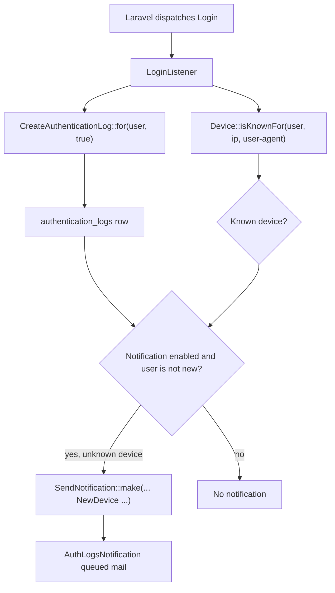
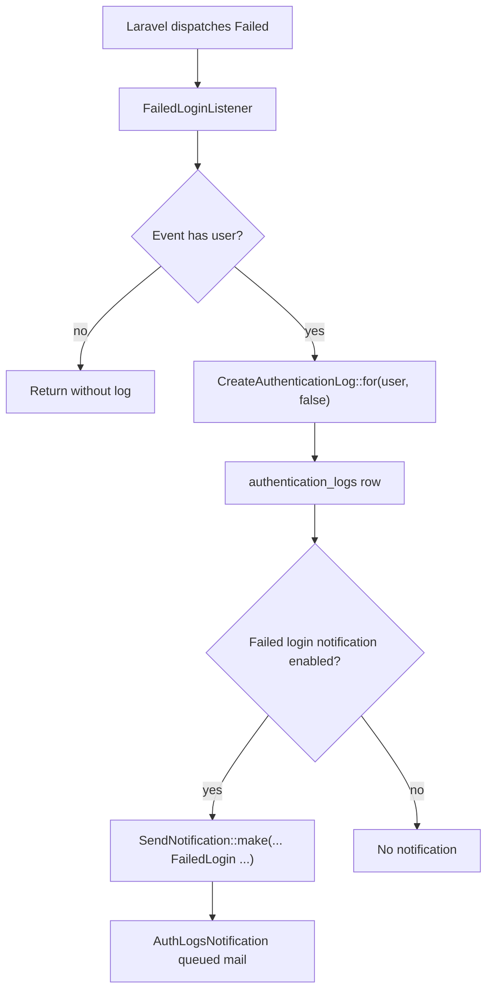
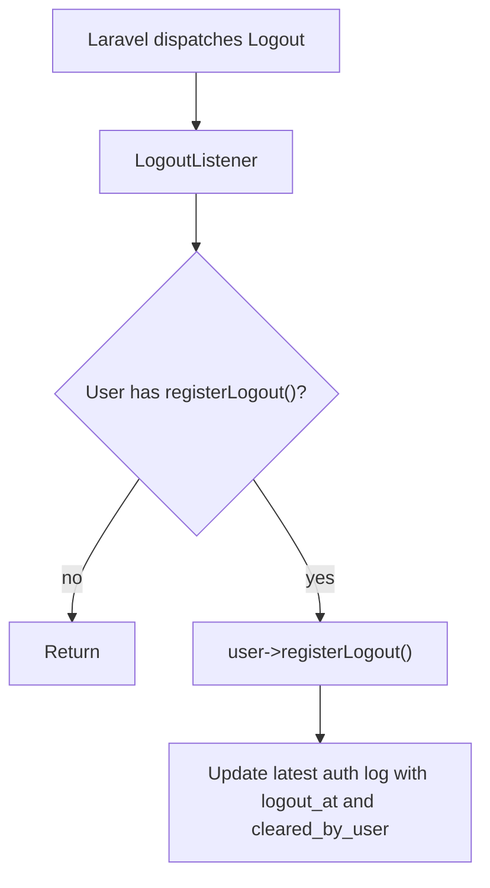
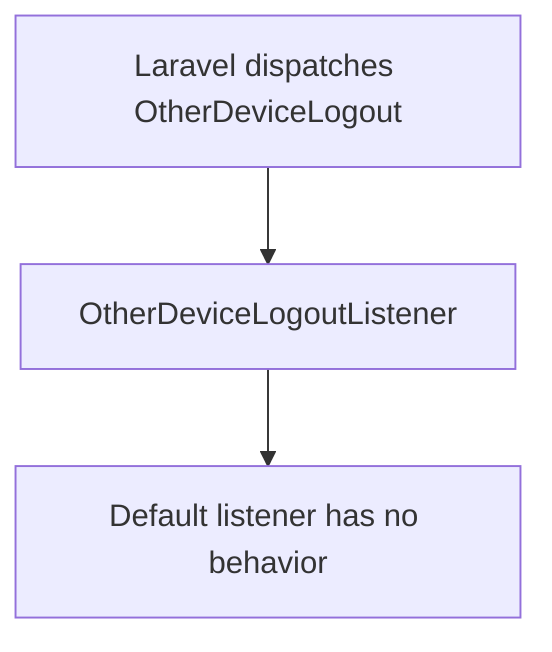
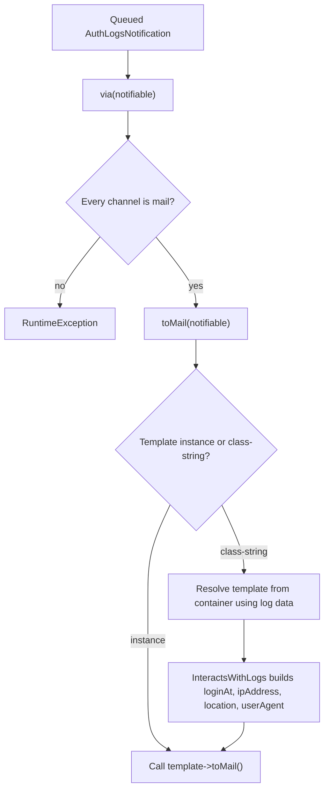
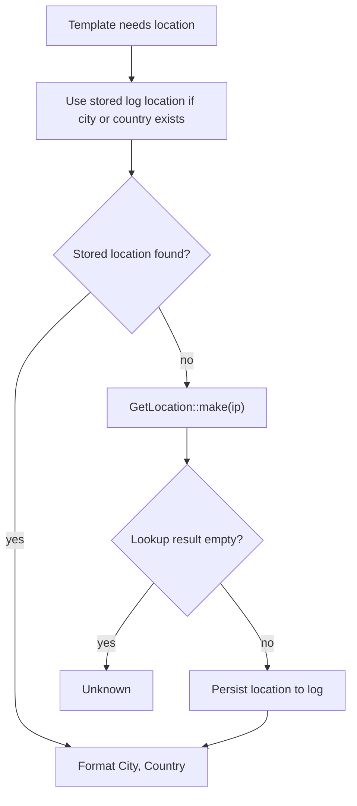
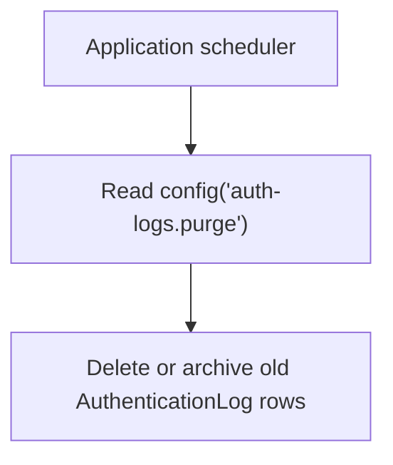

# Data Flow

This document describes runtime flows from Laravel authentication events to database records and notifications.

## Successful Login

Inputs:

- event user
- current request IP
- current request user-agent
- current `request()->location`
- `auth-logs.templates.new_device`

Outputs:

- a successful authentication log
- optionally a queued mail notification

## Failed Login

Inputs:

- failed auth event
- resolved user, if Laravel provides one
- current request context
- `auth-logs.templates.failed_login`

Outputs:

- a failed authentication log when a user exists
- optionally a queued mail notification

## Logout

Logout updates the latest authentication log. It does not create a separate logout record.

## Other Device Logout

This subscription exists so applications can replace the listener in config.

## Notification Rendering

If a template class-string is used, the notification needs an `AuthenticationLog` so it can resolve constructor data when the queued job runs.

## Geolocation

Geolocation is best-effort. It can be disabled with `auth-logs.geolocation_api = null`.

## Retention Flow

The package does not delete records on its own.

The host application should implement retention according to its privacy and compliance requirements.

**Previous:** [Architecture](05-architecture.md) | **Next:** [Security](07-security.md)
